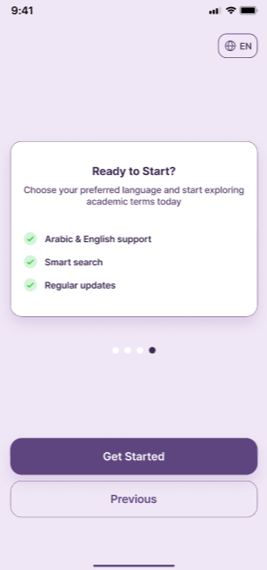
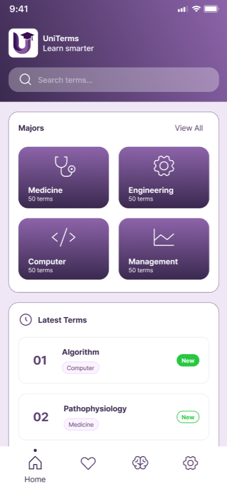
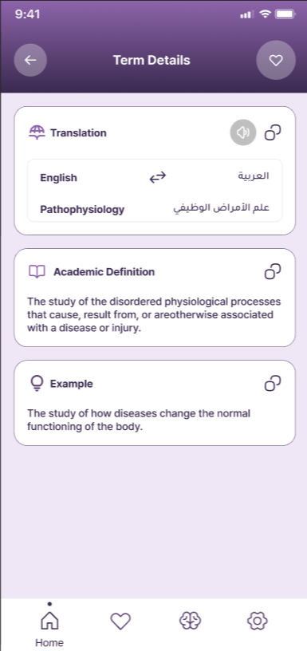
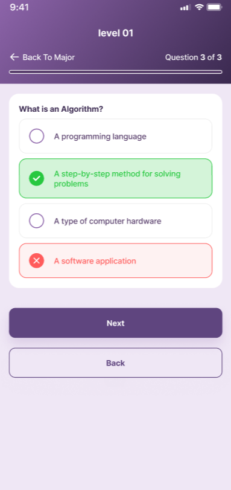
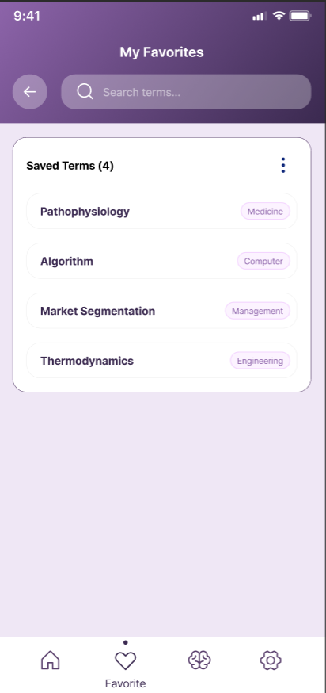

# UniTerms 🎓

A premium Flutter-based educational application designed to help university students learn and master academic terminology through an intuitive interface, interactive quizzes, and comprehensive search capabilities.

## 🌟 Features

* **Bilingual Support**: Full support for both Arabic and English languages with seamless on-the-fly switching.
* **Premium UI/UX**: Sleek, modern, and engaging user interface designed with attention to detail.
* **Comprehensive Glossary**: Browse terms by major/category with detailed definitions and examples.
* **Interactive Quizzes**: Test your knowledge with dynamic quizzes related to your field of study.
* **Smart Search**: Quickly find any term or category with our optimized search functionality.
* **Favorites System**: Save and organize important terms for quick access later.

## 🛠️ Tech Stack

* **Framework**: [Flutter](https://flutter.dev/)
* **Language**: Dart
* **State Management & Routing**: [GetX](https://pub.dev/packages/get)
* **Architecture**: MVVM-inspired architecture for clean separation of concerns.

## 📁 Project Structure

```text
lib/
├── core/           # App-wide constants, theme, colors, and translations
├── models/         # Data models
├── repositories/   # Data fetching and API logic (Mock/Real)
├── viewmodels/     # GetX Controllers handling business logic
├── views/          # UI Screens and Pages
├── widgets/        # Reusable global widgets
└── main.dart       # App entry point
```

## 🚀 Getting Started

### Prerequisites

* Flutter SDK (Latest stable version)
* Dart SDK
* Android Studio / VS Code with Flutter extensions

### Installation

1. Clone the repository:
   ```bash
   git clone https://github.com/Dhiaa-10/uni_terms.git
   ```
2. Navigate to the project directory:
   ```bash
   cd uni_terms
   ```
3. Get packages:
   ```bash
   flutter pub get
   ```
4. Run the app:
   ```bash
   flutter run
   ```


## 📱 Screenshots

| Onboarding | Home Screen | Term Details |
| :---: | :---: | :---: |
|  |  |  |
| **Quiz Interface** | **Favorites** | **Coming Soon...** |
|  |  |  |

## 🤝 Contributing
Contributions, issues, and feature requests are welcome!

---
*Developed with ❤️ using Flutter.*
